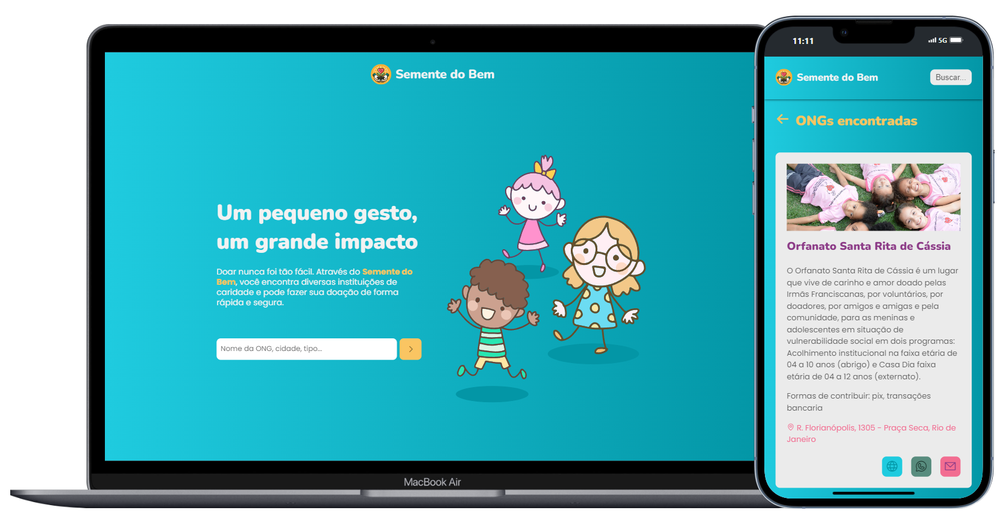

# Semente do Bem - *Um pequeno gesto, um grande impacto*

[Quero doar ❤️](https://semente-do-bem.vercel.app/)

## Descrição

O projeto Semente do Bem nasceu com o intuito de conectar possíveis doadores a organizações que prestam serviços sociais. Essas organizações necessitam muito de contribuições para continuar e funcionamento. E muitas vezes o usuário não sabe onde direcionar sua doação, qual instituição é confiável ou como fazer a doação de forma segura e transparente. O Semente do Bem surge como uma solução para esses desafios, oferecendo uma plataforma intuitiva e confiável para que as pessoas possam fazer o bem.

## Funcionalidades

Ao utilizar o Semente do Bem, os usuários podem:

* Encontrar instituições de acordo com seus interesses e valores.
* Acompanhar o impacto de suas doações.
* Participar de ações voluntárias.
* Conectar-se com uma comunidade engajada em causas sociais.

## Autor

Fabricio Liquesley dos Santos
